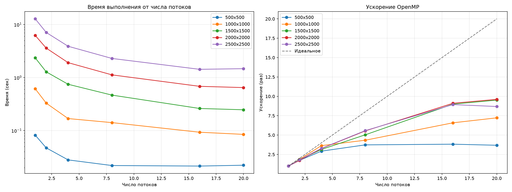

#  Лабораторная работа №1
## Перемножение квадратных матриц

### Описание
Программа на C++ умножает две квадратные матрицы, считывая их из файлов, и сохраняет результат в файл.

### Автор

**Рычажкова Анастасия**
Курс: Параллельное программирование

### Структура проекта

```
parallel-programming-labs/
├── lab1/                 
│   ├── src/
│   │   └── main.cpp
│   ├── input/
│   │   ├── matrix_a.txt
│   │   └── matrix_b.txt
│   └── output/
│       ├── result.txt
│       └── info.txt
├── lab1_openmp/                  
│   ├── src/
│   │   ├── main.cpp
│   │   ├── input/
│   │   │   ├── matrix_a.txt
│   │   │   └── matrix_b.txt
│   │   └── output/
│   │       ├── result.txt
│   │       └── info.txt
│   ├── input/
│   │   ├── matrix_a.txt
│   │   └── matrix_b.txt
│   └── output/
│       ├── experiments.txt
│       └── graphs.png
├── verify.py                     
├── generate_matrix.py            
├── experiments.py                
├── plot_graphs.py                
└── README.md
```

---


### Верификация

```
 ВЕРИФИКАЦИЯ ПРОЙДЕНА!
Максимальная ошибка: 0.0000000000
```

---

### Результаты экспериментов (OpenMP)

| Размер | Потоки | Время (сек) | Ускорение | Эффективность |
|--------|--------|-------------|-----------|---------------|
| 500    | 1      | 0.0822      | 1.00      | 100.0%        |
| 500    | 2      | 0.0474      | 1.73      | 86.7%         |
| 500    | 4      | 0.0281      | 2.93      | 73.1%         |
| 500    | 8      | 0.0220      | 3.73      | 46.6%         |
| 500    | 16     | 0.0215      | 3.82      | 23.9%         |
| 500    | 20     | 0.0223      | 3.69      | 18.5%         |
| 1000   | 1      | 0.6149      | 1.00      | 100.0%        |
| 1000   | 2      | 0.3303      | 1.86      | 93.1%         |
| 1000   | 4      | 0.1691      | 3.64      | 90.9%         |
| 1000   | 8      | 0.1418      | 4.34      | 54.2%         |
| 1000   | 16     | 0.0934      | 6.59      | 41.2%         |
| 1000   | 20     | 0.0851      | 7.22      | 36.1%         |
| 1500   | 1      | 2.3561      | 1.00      | 100.0%        |
| 1500   | 2      | 1.2862      | 1.83      | 91.6%         |
| 1500   | 4      | 0.7493      | 3.14      | 78.6%         |
| 1500   | 8      | 0.4681      | 5.03      | 62.9%         |
| 1500   | 16     | 0.2620      | 8.99      | 56.2%         |
| 1500   | 20     | 0.2476      | 9.52      | 47.6%         |
| 2000   | 1      | 6.2398      | 1.00      | 100.0%        |
| 2000   | 2      | 3.6045      | 1.73      | 86.6%         |
| 2000   | 4      | 1.9153      | 3.26      | 81.4%         |
| 2000   | 8      | 1.1266      | 5.54      | 69.2%         |
| 2000   | 16     | 0.6853      | 9.11      | 56.9%         |
| 2000   | 20     | 0.6491      | 9.61      | 48.1%         |
| 2500   | 1      | 12.8155     | 1.00      | 100.0%        |
| 2500   | 2      | 7.1140      | 1.80      | 90.1%         |
| 2500   | 4      | 3.9024      | 3.28      | 82.1%         |
| 2500   | 8      | 2.2984      | 5.58      | 69.7%         |
| 2500   | 16     | 1.4342      | 8.94      | 55.8%         |
| 2500   | 20     | 1.4751      | 8.69      | 43.4%         |

---

### Графики



На графиках показано:
- **Слева:** зависимость времени выполнения от числа потоков
- **Справа:** ускорение OpenMP по сравнению с идеальным ускорением

---

### Выводы

1. **Программа работает правильно** — верификация с NumPy показала нулевую ошибку.
2. **OpenMP ускоряет работу** — на 20 потоках ускорение достигает **9.6 раз** (на матрице 2000×2000).
3. **Чем больше матрица, тем лучше ускорение** — на маленьких матрицах эффект меньше.
4. **Слишком много потоков — не всегда хорошо** — после 16 потоков ускорение почти не растёт.
---

